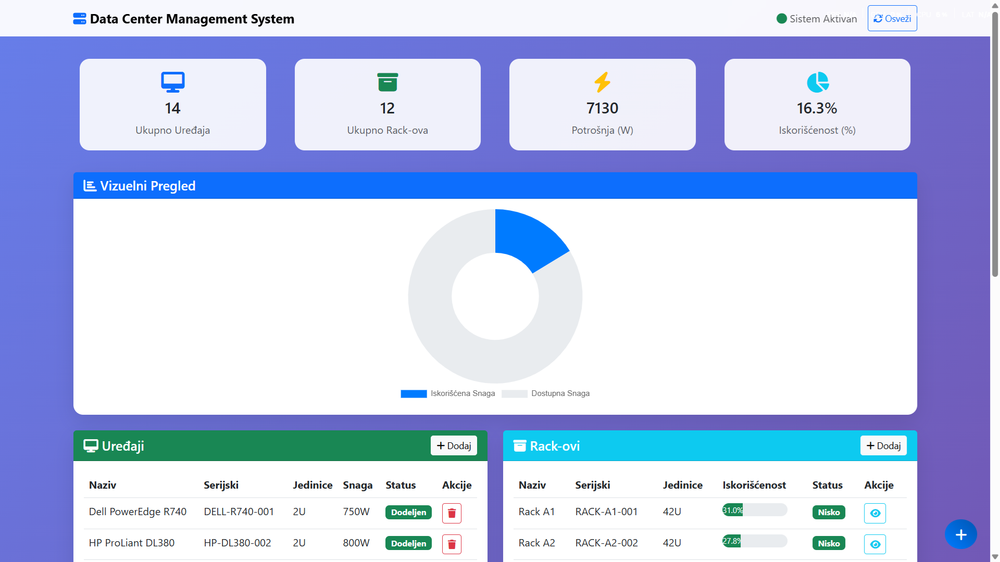

# MDS Datacenter Management API

REST API aplikacija za upravljanje uređajima i rack-ovima u data centru, sa validacijama kapaciteta (units + snaga), praćenjem potrošnje i predlogom balansiranog rasporeda uređaja po rack-ovima.

---

## 0) Brzi start (komisija) — Docker

**Projekat je Dockerizovan i ovo je primarni način pokretanja za evaluaciju.**

```bash
git clone https://github.com/resadsp/mds-datacenter-management-api.git
cd mds-datacenter-management-api
docker compose up -d --build
```

API je dostupan na: `http://localhost:8000`
Swagger: `http://localhost:8000/docs`

Seed nije obavezan za pokretanje API-ja, ali je **preporučen** zbog demo podataka
(baza `datacenter.db` je u `.gitignore` i može biti prazna).

Za komisiju se preporučuje da odmah nakon podizanja API-ja pokrene seed
(`POST /api/v1/seed`) kako bi svi endpoint-i imali podatke za demonstraciju.

Jednokratno (preporučeno):

```bash
curl -X POST http://localhost:8000/api/v1/seed
```

Ako `curl` nije dostupan, seed može da se pokrene kroz Swagger UI:

- otvoriti `http://localhost:8000/docs`
- pokrenuti `POST /api/v1/seed` (**Try it out** → **Execute**)

Provera da sve radi:

- Swagger: `http://localhost:8000/docs`
- Health: `http://localhost:8000/health`

Gašenje:

```bash
docker compose down
```

---

## 1) Kratak opis

Projekat implementira backend funkcionalnosti tražene zadatkom:

- CRUD za entitete **Device** i **Rack**
- Dodela uređaja rack-u uz pravila:
  - uređaj zauzima `units_occupied` jedinica,
  - ne sme se preći kapacitet rack-a (`total_units`),
  - ne sme se preći maksimalna deklarisana snaga (`max_power`)
- Rack detalji prikazuju i:
  - trenutnu ukupnu potrošnju (`current_power`)
  - trenutno zauzeće jedinica (`current_units`)
- Predlog rasporeda uređaja po rack-ovima (`/api/v1/balance/`) sa ciljem ujednačenije procentualne iskorišćenosti snage rack-ova.
- Swagger/OpenAPI dokumentacija.
- Dockerized deployment za lako testiranje.

> Napomena: auth/autorizacija nije implementirana jer nije deo zahteva.
> Napomena: UI nije obavezan po zadatku; aplikacija je namenjena korišćenju preko REST API poziva.

---

## 1.1) Usklađenost sa zadatkom (sažeto)

- Implementirani su entiteti `Device` i `Rack` sa traženim poljima i validacijama.
- Omogućene su CRUD operacije nad oba entiteta.
- Dodela uređaja rack-u je implementirana preko posebnog endpoint-a, uz proveru `total_units` i `max_power`.
- Pri dohvatanju rack-a vraćaju se i trenutna potrošnja (`current_power`) i zauzeće (`current_units`).
- Implementiran je endpoint za predlog balansiranog rasporeda (`/api/v1/balance/`) uz pretpostavku praznih rack-ova (predlog rasporeda).
- Unit testovi su pokriveni za funkcionalnost balansiranja (`tests/test_balancing.py`).

---

## 2) Tehnologije

- Python
- FastAPI
- SQLAlchemy
- SQLite (`datacenter.db`)
- Pytest
- Docker / Docker Compose

---

## 3) Struktura projekta (bitno za evaluaciju)

- `app/main.py` — FastAPI app i dashboard
- `app/models.py` — SQLAlchemy modeli
- `app/schemas.py` — Pydantic šeme
- `app/balancing.py` — algoritam balansiranja
- `app/routers/`:
  - `devices.py`
  - `racks.py`
  - `balancing.py`
  - `stats.py`
  - `seed.py` (**API seed endpoint**)
- `tests/test_balancing.py` — testovi balansiranja
- `seed.py` (root) — **CLI seed skripta** (`python seed.py`)
- `Dockerfile`
- `docker-compose.yml`

---

## 4) Pokretanje aplikacije (Docker — primarno za evaluaciju)

### Opcija A: Docker Compose

```bash
docker compose up --build
```

Aplikacija:

- API: `http://localhost:8000`
- Swagger UI: `http://localhost:8000/docs`
- OpenAPI JSON: `http://localhost:8000/openapi.json`

Gašenje:

```bash
docker compose down
```

### Opcija B: samo Dockerfile

```bash
docker build -t mds-datacenter-api .
docker run --rm -p 8000:8000 mds-datacenter-api
```

---

## 5) Seed podaci (2 načina)

Baza `datacenter.db` je u `.gitignore`, pa su obezbeđena **dva načina** za seed:

### A) CLI seed (root fajl)

```bash
python seed.py
```

### B) API seed endpoint

```bash
curl -X POST http://localhost:8000/api/v1/seed
```

> Seed je namenjen brzom punjenju test podacima za komisiju.
> Ako je baza već seedovana, API seed endpoint vraća `409 Database already seeded`.

---

## 6) Lokalno pokretanje (bez Docker-a)

```bash
python -m venv .venv
source .venv/bin/activate
pip install -r requirements.txt
python seed.py
./run.sh
```

Alternativno:

```bash
uvicorn app.main:app --reload --host 0.0.0.0 --port 8000
```

---

## 7) Testovi

Pokretanje svih testova:

```bash
pytest -q
```

Pokretanje samo balansiranja:

```bash
pytest -v tests/test_balancing.py
```

---

## 8) API rute

### Devices

- `POST /api/v1/devices/`
- `GET /api/v1/devices/`
- `GET /api/v1/devices/{device_id}`
- `PUT /api/v1/devices/{device_id}`
- `DELETE /api/v1/devices/{device_id}`
- `POST /api/v1/devices/{device_id}/assign/{rack_id}`
- `POST /api/v1/devices/{device_id}/unassign`

### Racks

- `POST /api/v1/racks/`
- `GET /api/v1/racks/`
- `GET /api/v1/racks/{rack_id}`
- `PUT /api/v1/racks/{rack_id}`
- `DELETE /api/v1/racks/{rack_id}`

### Balancing

- `POST /api/v1/balance/`

### Stats

- `GET /api/v1/stats/`

### Seed

- `POST /api/v1/seed`

Detaljni request/response modeli su u Swagger dokumentaciji (`/docs`).

---

## 9) Kako se uređaj dodeljuje rack-u (primer)

Ako već postoje rack i uređaj, dodela se radi jednim pozivom:

- `POST /api/v1/devices/{device_id}/assign/{rack_id}`

Praktični tok (od prazne baze) je 3 koraka:

1. kreiraj rack (`POST /api/v1/racks/`)
2. kreiraj uređaj (`POST /api/v1/devices/`)
3. dodeli uređaj rack-u (`POST /api/v1/devices/{device_id}/assign/{rack_id}`)

Primer:

```bash
# 1) Kreiraj rack
curl -X POST http://localhost:8000/api/v1/racks/ \
  -H "Content-Type: application/json" \
  -d '{
    "name": "Rack A1",
    "description": "Glavni rack",
    "serial_number": "RACK-A1-001",
    "total_units": 42,
    "max_power": 10000
  }'

# 2) Kreiraj uređaj
curl -X POST http://localhost:8000/api/v1/devices/ \
  -H "Content-Type: application/json" \
  -d '{
    "name": "Server Dell R740",
    "description": "DB server",
    "serial_number": "DEV-R740-001",
    "units_occupied": 2,
    "power_consumption": 450
  }'

# 3) Dodeli uređaj rack-u (zameni PLACEHOLDER vrednosti stvarnim ID-jevima)
curl -X POST http://localhost:8000/api/v1/devices/{DEVICE_ID}/assign/{RACK_ID}
```

Napomena: primeri iznad su pisani za `bash` (Linux/macOS). Na Windows CMD/PowerShell sintaksa za varijable i navodnike može da se razlikuje.

Windows (PowerShell) primer sa jedinstvenim serijskim brojevima:

```powershell
$R = Get-Date -UFormat %s

curl.exe -X POST http://localhost:8000/api/v1/racks/ -H "Content-Type: application/json" -d "{\"name\":\"Rack A1\",\"description\":\"Glavni rack\",\"serial_number\":\"RACK-A1-$R\",\"total_units\":42,\"max_power\":10000}"

curl.exe -X POST http://localhost:8000/api/v1/devices/ -H "Content-Type: application/json" -d "{\"name\":\"Server Dell R740\",\"description\":\"DB server\",\"serial_number\":\"DEV-R740-$R\",\"units_occupied\":2,\"power_consumption\":450}"
```

Ako je uređaj već dodeljen ili rack nema dovoljno kapaciteta (`total_units` / `max_power`), API vraća `400`.

Napomena: `DEVICE_ID` i `RACK_ID` uzimaš iz JSON odgovora prethodnih `POST /api/v1/devices/` i `POST /api/v1/racks/` poziva (polje `id`).
Napomena: `serial_number` za `Device` i `Rack` mora biti jedinstven; za duplikat API vraća `400`.

---

## 10) Balancing logika (sažeto)

Endpoint prima listu uređaja i rack-ova i vraća:

- dodeljene parove `device_id -> rack_id`
- listu nedodeljenih uređaja (ako nema kapaciteta)

Pri predlogu se vodi računa o:

- `total_units` kapacitetu rack-a
- `max_power` kapacitetu rack-a
- cilju što ujednačenijeg procentualnog opterećenja snage rack-ova

Napomena: balansiranje ne uzima u obzir trenutni raspored u bazi i ne određuje tačne U pozicije uređaja, već daje predlog rasporeda po rack-ovima na nivou kapaciteta.

Output je **predlog rasporeda**.

---

## 11) Screenshot dashboard-a

Dashboard je dodatna pomoćna vizualizacija; primarni način upotrebe i evaluacije je kroz REST API (`/docs`, `curl`, Postman).



---

## 12) Troubleshooting

Ako `docker compose up` prijavi `port 8000 already allocated`:

- ugasiti proces/kontejner koji koristi 8000, ili
- promeniti mapiranje porta u `docker-compose.yml` na npr. `8001:8000`, pa koristiti `http://localhost:8001/docs`.

Ako na Windows-u dobiješ grešku:

`open //./pipe/dockerDesktopLinuxEngine: The system cannot find the file specified`

to znači da Docker Desktop Linux engine nije pokrenut ili nije izabran pravi Docker context.

Koraci:

1. Pokreni Docker Desktop i sačekaj status **Engine running**.
2. U Docker Desktop podešavanjima proveri da je uključeno **Use the WSL 2 based engine**.
3. U terminalu proveri i prebaci context na Linux engine:

  ```bash
  docker context ls
  docker context use desktop-linux
  docker version
  ```

4. Ako i dalje ne radi, resetuj WSL i Docker Desktop:

  ```powershell
  wsl --shutdown
  ```

  zatvori i ponovo pokreni Docker Desktop, pa probaj opet:

  ```bash
  docker compose up --build
  ```

Ako Docker Desktop ne može da startuje engine, uradi update WSL-a:

```powershell
wsl --update
```

---

## 13) Verzija

- API verzija: `1.0.0`
- Datum finalne pripreme: 24.02.2026.